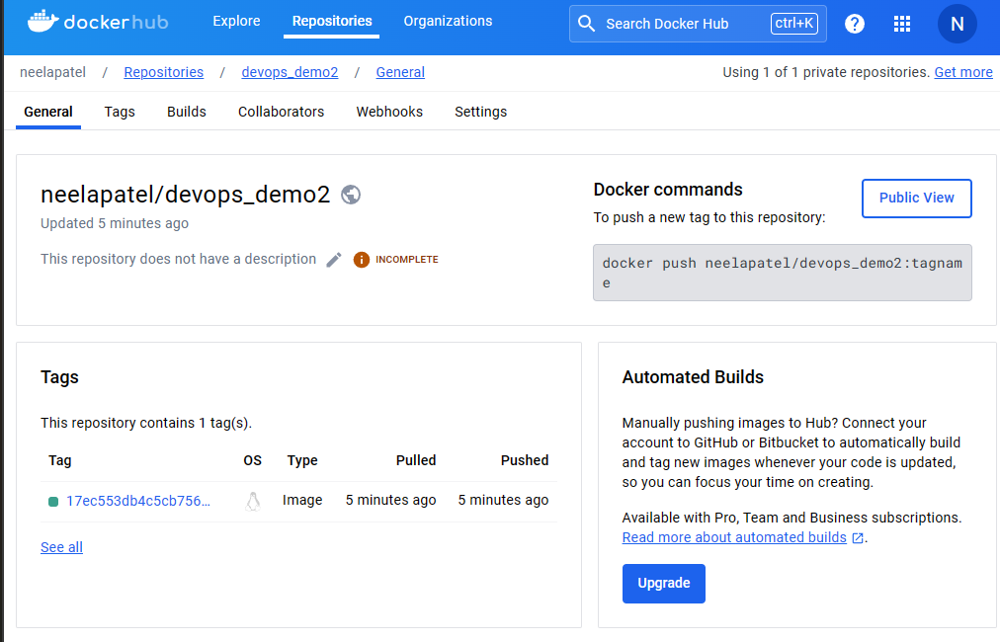

Docker Hub for this HW: https://hub.docker.com/repository/docker/neelapatel/devops_demo2/general

# RestAPI for Creating QR Codes

For this assignment I want you to go over the videos and I've created a X number of errors in the code that you will have to find and fix them.  You should keep running the tests and read the error and try to understand what it mean.  The purpose of this assignment is to get you accustomed to running the project and following the steps that the program uses to process requests.

Here is my repo with the working code: [https://github.com/kaw393939/fastapi_spring2024](https://github.com/kaw393939/fastapi_spring2024)

You can get this repo working with the install instructions below.  The assignment repo will not work because its filled with broken code.

**To submit this assignment, you should make your own repository and add the remote to git and then push your fixed code to your own repo.** 

## Grading

You will only get 100 if the entire QR program passes GitHub actions, so you will need to update the production.yml file to have your info and setup your environment variables on the repository.

# Instructor Videos
* [Rest API Project Overview](https://youtu.be/xEcBKSSXxhQ)
* [QR Code Overview for Assignment](https://youtu.be/E6b9VkQpQ-U)

## Optional but extremely helpful:

1. [Best Series to Learn Bash Scripting Seriously learn this!!!](https://www.youtube.com/playlist?list=PLIhvC56v63IKioClkSNDjW7iz-6TFvLwS)

2.  [Listen to someone else explain FastAPI and go through a project](https://www.youtube.com/watch?v=cbASjoZZGIw)

# Install
1. Clone
2. Make virtual environment:  python3 -m venv venv
3. Activate virtual environment: source venv/bin/activate
4. Install requirements: pip install -r requirements.txt
5. **IMPORTANT** run: mkdir qr_codes to create a qr codes directory to save in, permissions will be messed up and the docker container won't be able to write to the qr_codes directory if you don't.
6. Note: make sure docker is started
7. run pytest locally to check that it works locally
8. Start the app with docker compose up --build
9. Goto http://localhost/docs to view openapi spec documentation
10. Click "authorize" input username: admin password: secret
11. Test making,  retrieving, and deleting QR codes on the spec page.

